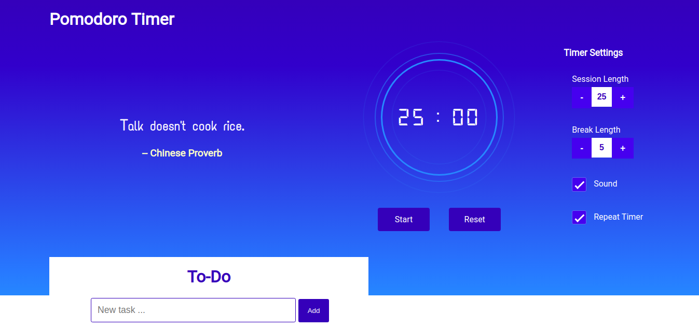

# Pomodoro Timer

The Pomodoro Technique is a time management method
The technique uses a timer to break down work into intervals,
traditionally 25 minutes in length, separated by short breaks

To-Do

Todo list application allows users to manage their tasks

[Live link](https://srikanthkanjarla.github.io/pomodoro-timer/)

## Screenshots

### _Landing Page_

## Technologies Used

### Languages and Frameworks

    	* React.js
    	* Redux
    	* IndexedDB

### API (none used)

    	* API()

Please offer report any feedback to me via Pull Request and/or Twitter dm @srikanth_k.

Thanks for reading thus far,
srikanth kanjarla
